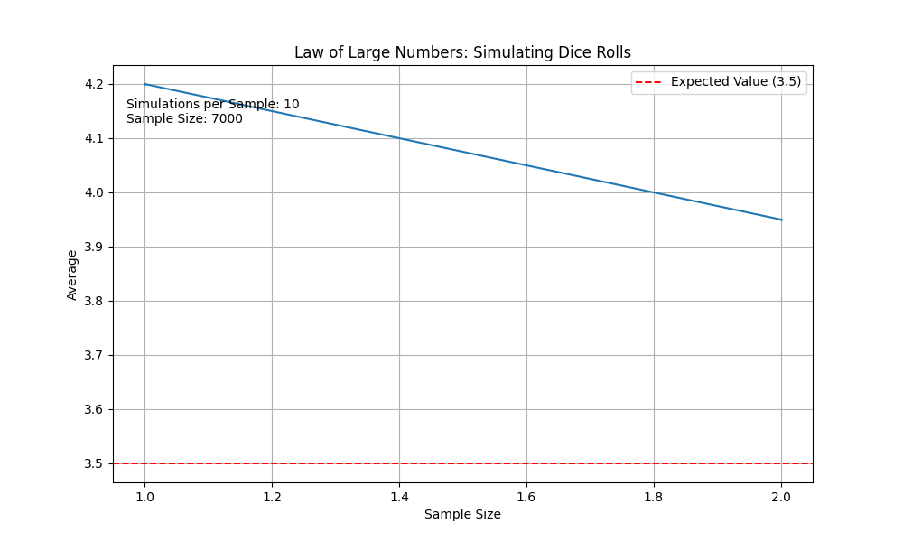

# Law of Large Numbers Simulation



This simulation provides a visual representation of the Law of Large Numbers, a fundamental concept in probability and statistics. The Law of Large Numbers states that as the size of a sample increases, the sample mean gets closer to the population mean. In simpler terms, it explains how the average of a large number of observations tends to converge to the expected value.

## Overview

This project aims to illustrate the Law of Large Numbers using a simple simulation. It generates a sequence of random numbers from a specified distribution and calculates the running average as more numbers are generated. The simulation then plots the running average against the number of observations, showing how the average stabilizes as the number of observations increases.

## Features

- Easy-to-understand simulation of the Law of Large Numbers.
- Visualization of the convergence of the running average to the expected value.
- Adjustable parameters to customize the simulation experience.

## Usage

To use this simulation, follow these steps:

1. Clone the repository to your local machine:

   ```bash
   git clone https://github.com/mirolaukka/law-of-large-numbers.git
   cd law-of-large-numbers
   ```

2. Install the required libraries using `pip`:

   ```bash
   pip install -r requirements.txt
   ```

3. Run the simulation script:

   ```bash
   python main.py
   ```

   The simulation will generate random numbers, calculate running averages, and display the visualization of how the running average converges.

Please note that you can modify the simulation parameters within the `main.py` script to customize the behavior of the simulation, such as the distribution of random numbers, the number of observations, etc.


## License

This project is licensed under the [MIT License](LICENSE), which means you are free to use, modify, and distribute the code in your own projects.
